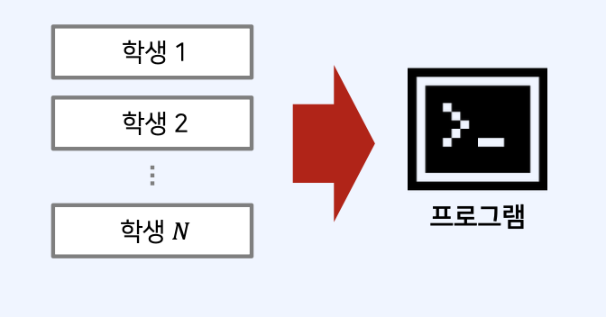
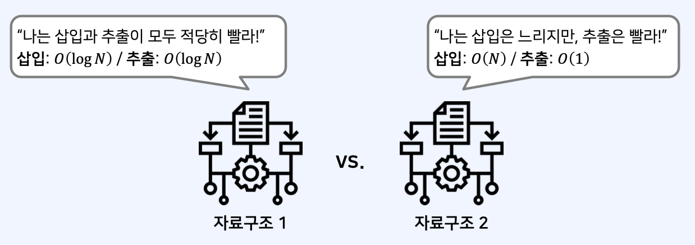
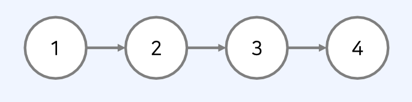
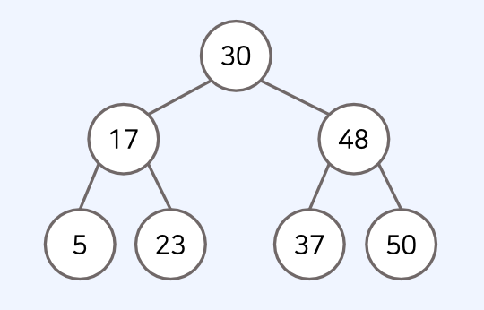
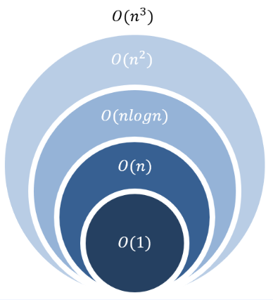
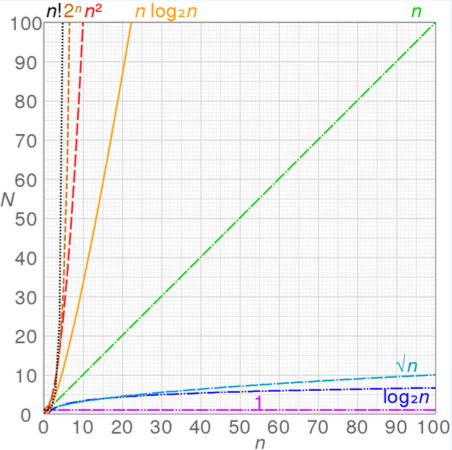

## 자료구조(Data Structure)란?

- 자료구조는 다수의 자료를 담기 위한 구조를 말한다.
- 데이터의 수가 많아질수록 효율적인 자료구조가 필요하다.
- 예시) 학생 수가 1,000,000명 이상인 학생 관리 프로그램
  

## 자료구조의 개요

- 자료구조의 필요성에 대해서 이해가 필요하다
- 성능 비교: 자료구조/알고리즘의 성능 측정 방법에 대해 이해가 필요하다
  

## 자료구조의 필요성

- 데이터를 효과적으로 저장하고, 처리하는 방법에 대해 바르게 이해할 수 있어야 한다.
- 자료구조를 제대로 이해하지 못하면 불필요한 메모리와 계산 낭비를 할 여지가 생긴다.

- C언어를 기분으로 정수(int) 형식의 데이터가 100만 개가랑이 존재한다고 가정하자
- 해당 프로그램을 이용하면, 내부적으로 하루에 데이터 조회가 1억 번 이상 발생한다.
- 이때 원하는 데이터를 가장 빠르게 찾도록 해주는 자료구조는 무엇일까?
  -> 트리와 같은 자료 구조를 활용할 수 있을 것이다.

## 자료구조의 종류

1. 선형 구조

- 배열
- 연결리스트
- 스택
- 큐

2. 비선형구조

- 트리
- 그래프

### 1. 선형 자료구조(Linear Data Structure)

- 선형 자료구조는 하나의 데이터 뒤에 다른 데이터가 존재하는 자료 구조를 말한다.
- 데이터가 일렬로 연속적으로 연결되어 있다.
  ex) 배열, 연결리스트, 스택, 큐
  

### 2. 비선형 자료구조(Non-Linear Data Structure)

- 비선형 자료구조는 하나의 데이터 뒤에 다른 데이터가 여러 개 올 수 있는 자료구조다.
- 데이터가 일직선상으로 연결되어 있지 않아도 된다.
  ex) 트리, 그래프
  

## 자료구조와 알고리즘

1. 효율적인 자료구조 설계를 위해 알고리즘 지식이 필요하다.
2. 효율적인 알고리즘을 작성하기 위해서 문제 상황에 맞는 적절한 자료구조가 사용되어야 한다.
3. 프로그램을 작성할 때 자료구조와 알고리즘 모두 고려해야 한다.

## 프로그램 성능 측정 방법

- 시간 복잡도(time complexity): 알고리즘에 사용되는 연산 횟수를 측정한다.
- 공간 복잡도(space complexity): 알고리즘에 사용되는 메모리의 양을 측정한다.
- 공간을 많이 사용하는 대신 시간을 단축하는 방법이 흔히 사용된다.

## 프로그램의 성능 측정 방법: Big-O 표기법

- 복잡도를 표현할 때는 Big-O 표기법을 사용한다.

1. 특정한 알고리즘이 얼마나 효율적인지 수치적으로 표현할 수 있다.
2. 가장 빠르게 증가하는 항만을 고려하는 표기법이다.
   ex) 다음 알고리즘의 시간 복잡도는?

시간 복잡도 : O(n)

```js
let n = 10;
let summary = 0;
for (let i = 0; i < n; i++) {
  summary += i;
}
console.log(summary); // 45
```

시간 복잡도 : O(𝑛2)

```js
let n = 9;
for (let i = 1; i <= n; i++) {
  for (let j = 1; j <= n; j++) {
    console.log(`${i} X ${j} = ${i * j}`);
  }
}

// 1 X 1 = 1
// 1 X 2 = 2
// …
// 9 X 8 = 72
// 9 X 9 = 81
```

## 프로그램의 성능 측정 방법

- 일반적으로 연산 횟수가 10억을 넘어가면 1초 이상의 시간이 소요된다.

ex) 𝑛이 1,000일 때를 고려해 보자.
• 𝑂 𝑛 : 약 1,000번의 연산
• 𝑂 𝑛𝑙𝑜𝑔𝑛 : 약 10,000번의 연산
• 𝑂 𝑛2 : 약 1,000,000번의 연산
• 𝑂 𝑛3 : 약 1,000,000,000번의 연산




## 프로그램의 성능 측정 방법

- Big-O 표기법으로 시간 복잡도를 표기할 때는 가장 큰 항만을 표시한다.
  • 가장 큰 항에 붙어 있는 계수는 제거한다.
  16

- 프로그램의 성능 측정 방법
  𝑂(3𝑛2 + 𝑛)= 𝑂(𝑛2)
  • 현실 세계에서는 동작 시간이 1초 이내인 알고리즘을 설계할 필요가 있다.

- 코딩 테스트에서 메모리의 크기를 나타낼 때는 일반적으로 MB 단위로 표기한다.
  ```
  int a[1000]: 4KB
  int a[1000000]: 4MB
  int a[2000][2000]: 16MB
  ```
