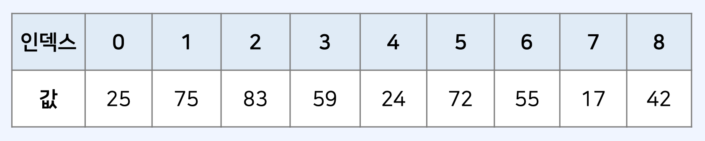
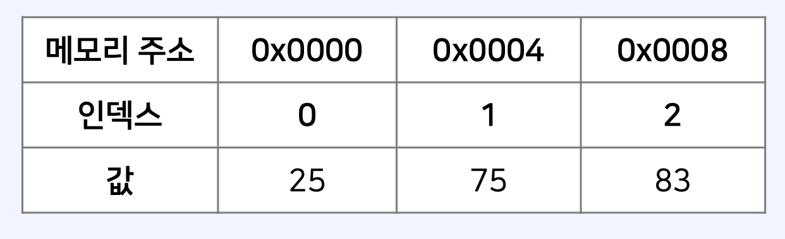
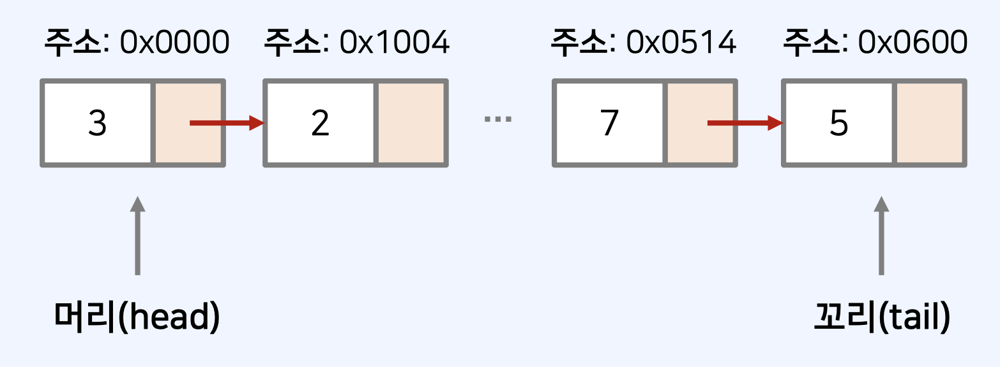

## 배열(Array)

- 가장 기본적인 자료구조다.
- 여러 개의 변수를 담는 공간으로 이해할 수 있다.
- 배열은 인덱스(index)가 존재하며, 인덱스는 0부터 시작한다.
- 특정한 인덱스에 직접적으로 접근 가능 → 수행 시간: 𝑂(1)



### 배열의 특징

- 컴퓨터의 메인 메모리에서 배열의 공간은 연속적으로 할당된다.
- 장점: 캐시(cache) 히트 가능성이 높으며, 조회가 빠르다.
- 단점: 배열의 크기를 미리 지정해야 하는 것이 일반적이므로, 데이터의 추가 및 삭제에 한계가 있다.



## 연결 리스트(Linked List)

- 연결 리스트는 컴퓨터의 메인 메모리상에서 주소가 연속적이지 않다.
- 배열과 다르게 크기가 정해져 있지 않고, 리스트의 크기는 동적으로 변경 가능하다.
- 장점: 포인터(pointer)를 통해 다음 데이터의 위치를 가리킨다는 점에서 삽입과 삭제가 간편하다.
- 단점: 특정 번째의 원소를 검색할 때는 앞에서부터 원소를 찾아야 하므로, 데이터 검색 속도가 느리다.



## JavaScript의 배열

- JavaScript의 배열 자료형은 동적 배열이다.
- 배열의 용량이 가득 차면, 자동으로 크기를 증가시킨다.
- 내부적으로 포인터(pointer)를 사용하여, 연결 리스트의 장점도 가지고 있다.
- 배열(array) 혹은 스택(stack)의 기능이 필요할 때 사용할 수 있다.
  - [참고] 큐(queue)의 기능을 제공하지 못한다. (비효율적)

### JavaScript 배열 초기화 방법

```js
// 빈 배열 생성
let arr = [];

arr.push(7);
arr.push(8);
arr.push(9);

for (let i = 0; i < arr.length; i++) {
  console.log(arr[i]);
}

// Array() 사용
let arr = new Array();

arr.push(7);
arr.push(8);
arr.push(9);

for (let i = 0; i < arr.length; i++) {
  console.log(arr[i]);
}
```

### 크기가 N X M인 2차원 리스트(배열) 만들기

: 2차원 배열이 필요할 때는 다음과 같이 원하는 값을 직접 넣어 초기화하거나
Array()를 사용할 수 있다.

```js
let arr1 = [
  [0, 1, 2, 3],
  [4, 5, 6, 7],
  [8, 9, 10, 11],
];
console.log(arr1);
// [
//  [ 0, 1, 2, 3 ],
//  [ 4, 5, 6, 7 ],
//  [ 8, 9, 10, 11 ]
// ]

let arr = Array.from(Array(4), () => new Array(5));
console.log(arr);
// [
//  [ <5 empty items> ],
//  [ <5 empty items> ],
//  [ <5 empty items> ],
//  [ <5 empty items> ]
// ]
```

### 문제: Array.from() + 반복문을 이용해 2차원 배열을 값으로 초기화하려면?

```js
//
//
//
//
//
//
//
//
//
```

```js
let arr2 = new Array(3);
for (let i = 0; i < arr2.length; i++) {
  arr2[i] = Array.from({ length: 4 }, (undefined, j) => i * 4 + j);
}
console.log(arr2);
```

### JavaScript 배열의 대표적인 메서드

- **concat**(): 여러 개의 배열을 이어 붙여서 합친 결과를 반환한다. 𝑂(𝑁)

```js
let arr1 = [1, 2, 3, 4, 5];
let arr2 = [6, 7, 8, 9, 10];
let arr = arr1.concat(arr2, [11, 12], [13]);

//[ 1, 2, 3, 4, 5, 6, 7, 8, 9, 10, 11, 12, 13 ]

console.log(arr);
```

- **slice**(left, right): 특정 구간의 원소를 꺼낸 배열을 반환한다. 𝑂(𝑁)

```js
let arr = [1, 2, 3, 4, 5];
let result = arr.slice(2, 4);

console.log(result);
//[ 3, 4 ]
```

- **indexOf**(): 특정한 값을 가지는 원소의 첫째 인덱스를 반환한다. 𝑂(𝑁)
  - 만약, 해당하는 원소가 없는 경우-1을 반환한다.

```js
let arr = [7, 3, 5, 6, 6, 2, 1];

console.log(arr.indexOf(5)); // 2
console.log(arr.indexOf(6)); // 1
console.log(arr.indexOf(8)); // -1
```
