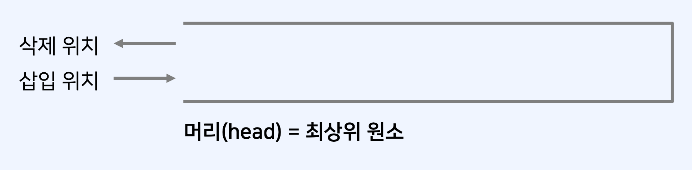
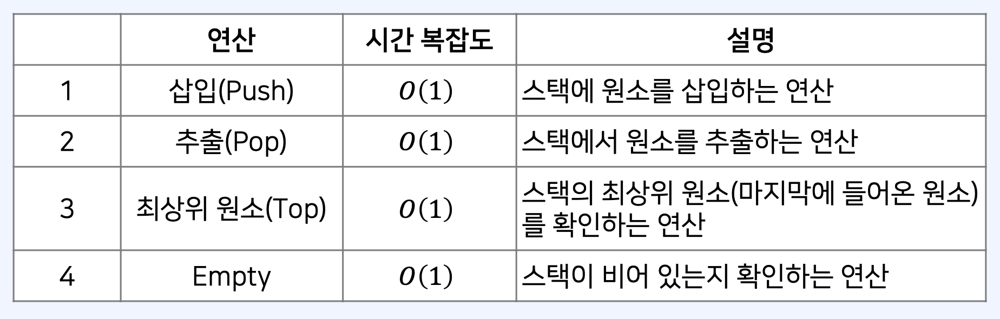

## 스택

: 먼저 들어온 데이터가 나중에 나가는 자료구조

- 흔히 박스가 쌓인 형태를 스택(stack)이라고 한다.
- 우리가 박스를 쌓은 뒤에 꺼낼 때는, 가장 마지막에 올렸던 박스부터 꺼내야 한다.
- 새로운 원소를 삽입할 때는 마지막 위치에 삽입한다.
- 새로운 원소를 삭제할 때는 마지막 원소가 삭제된다.

- 스택에 여러 개의 데이터를 삽입하고 삭제하는 예시를 확인해 보자. <br/>
  ex) 전체 연산: <br/>
  삽입 3 – 삽입 5 – 삭제 – 삽입 7 – 삭제 – 삽입 8 – 삭제 – 삽입 2 – 삽입 9
  

- 스택은 여러 가지 연산을 제공한다.
  

## JavaScript에서 스택을 구현하는 방법- 배열 자료형

- JavaScript의 기본적인 배열 자료형은 다음의 두 가지 메서드를 제공한다.

  - 𝑝𝑢𝑠ℎ() 메서드: 마지막 위치에 원소를 삽입하며, 시간 복잡도는 𝑂(1) 이다.
  - 𝑝𝑜𝑝() 메서드: 마지막 위치에서 원소를 추출하며, 시간 복잡도는 𝑂(1) 이다.

- 따라서 일반적으로 스택을 구현할 때, JavaScript의 배열(array) 자료형을 사용한다.

```js
let stack = [];
// 삽입(5) - 삽입(2) - 삽입(3) - 삽입(7) - 삭제() - 삽입(1) - 삽입(4) - 삭제()
stack.push(5);
stack.push(2);
stack.push(3);
stack.push(7);
stack.pop();
stack.push(1);
stack.push(4);
stack.pop();
let reversed = stack.slice().reverse();
console.log(reversed); // 최상단 원소부터 출력
console.log(stack);
```

## 연결 리스트로 스택 구현하기

: 스택을 연결 리스트로 구현하면, 삽입과 삭제에 있어서 𝑂(1) 을 보장할 수 있다.

- 연결 리스트로 구현할 때는 머리(head)를 가리키는 하나의 개의 포인터만 가진다.
- 머리(head): 남아있는 원소 중 가장 마지막에 들어 온 데이터를 가리키는 포인터

- 삽입할 때는 머리(head) 위치에 데이터를 넣는다.
- 삭제할 때는 머리(head) 위치에서 데이터를 꺼낸다.
