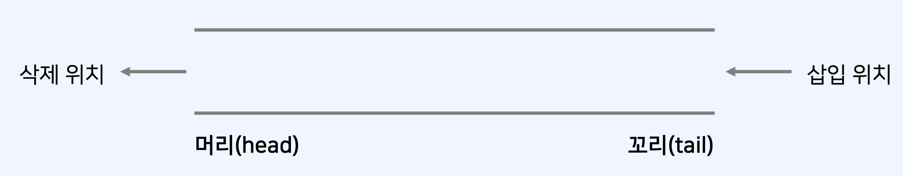
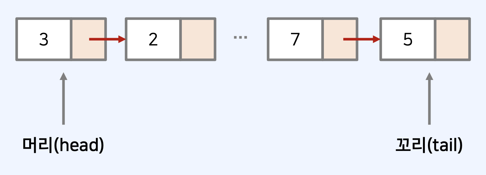

## 큐(Queue)

- 큐(queue)는 먼저 삽입된 데이터가 먼저 추출되는 자료구조(data structure)다.

  - 예시) 게임 대기 큐는 먼저 대기한 사람이 먼저 게임에 매칭된다.

- 큐에 여러 개의 데이터를 삽입하고 삭제하는 예시를 확인해 보자.<br/>
  ex) 전체 연산: <br/>
  삽입 3 – 삽입 5 – 삭제 – 삽입 7 – 삭제 – 삽입 8 – 삭제 – 삽입 2 – 삽입 9
  

## 연결 리스트로 큐 구현하기

- 큐를 연결 리스트로 구현하면, 삽입과 삭제에 있어서 𝑂(1) 을 보장할 수 있다.
- 연결 리스트로 구현할 때는 머리(head)와 꼬리(tail) 두 개의 포인터를 가진다.
- 머리(head): 남아있는 원소 중 가장 먼저 들어 온 데이터를 가리키는 포인터
- 꼬리(tail): 남아있는 원소 중 가장 마지막에 들어 온 데이터를 가리키는 포인터
  
- 삽입할 때는 꼬리(tail) 위치에 데이터를 넣는다.
- 삭제할 때는 머리(head) 위치에서 데이터를 꺼낸다.

## 큐 동작 속도: 배열 vs. 연결 리스트

- 다수의 데이터를 삽입 및 삭제할 때에 대하여, 수행 시간을 측정할 수 있다.
- 단순히 배열 자료형을 이용할 때보다 연결 리스트를 사용할 때 수행 시간 관점에서 효율적이다.
- JavaScript에서는 Dictionary 자료형을 이용하여 큐(queue)를 구현하면 간단하다.

## JavaScript 큐(Queue) 구현하기

```js
class Queue {
  constructor() {
    this.items = {};
    this.headIndex = 0;
    this.tailIndex = 0;
  }
  enqueue(item) {
    this.items[this.tailIndex] = item;
    this.tailIndex++;
  }
  dequeue() {
    const item = this.items[this.headIndex];
    delete this.items[this.headIndex];
    this.headIndex++;
    return item;
  }
  peek() {
    return this.items[this.headIndex];
  }
  getLength() {
    return this.tailIndex - this.headIndex;
  }
}
```

```js
// 구현된 큐(Queue) 라이브러리 사용
queue = new Queue();
// 삽입(5) - 삽입(2) - 삽입(3) - 삽입(7)
// - 삭제() - 삽입(1) - 삽입(4) - 삭제()
queue.enqueue(5);
queue.enqueue(2);
queue.enqueue(3);
queue.enqueue(7);
queue.dequeue();
queue.enqueue(1);
queue.enqueue(4);
queue.dequeue();
// 먼저 들어온 순서대로 출력
while (queue.getLength() != 0) {
  console.log(queue.dequeue());
}
```
