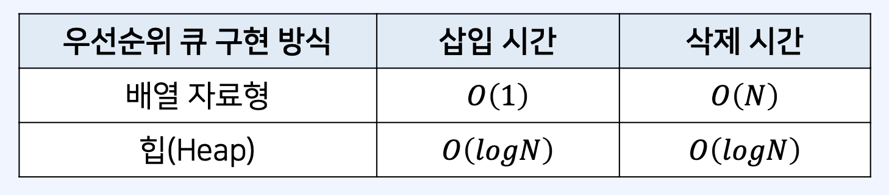

## 트리(Tree)

- 트리는 가계도와 같이 계층적인 구조를 표현할 때 사용할 수 있는 자료구조다.
- 나무(tree)의 형태를 뒤집은 것과 같이 생겼다.


- 루트 노드(root node): 부모가 없는 최상위 노드
- 단말 노드(leaf node): 자식이 없는 노드


트리(tree)에서는 부모와 자식 관계가 성립한다. <br/>
형제 관계: 17을 값으로 가지는 노드와 48을 가지는 노드 사이의 관계


- 깊이(depth): 루트 노드에서의 길이(length)
  - 이때, 길이란 출발 노드에서 목적지 노드까지 거쳐야 하는 간선의 수를 의미한다.
  - 트리의 높이(height)는 루트 노드에서 가장 깊은 노드까지의 길이를 의미한다.

### 이진 트리(Binary Tree)

이진 트리는 최대 2개의 자식을 가질 수 있는 트리를 말한다.


### 우선순위 큐(Priority Queue)

- 우선순위 큐는 우선순위에 따라서 데이터를 추출하는 자료구조다.
- 컴퓨터 운영체제, 온라인 게임 매칭 등에서 활용된다.
- 우선순위 큐는 일반적으로 힙(heap)을 이용해 구현한다.
  

- 우선순위 큐는 다양한 방법으로 구현할 수 있다.
- 데이터의 개수가 𝑁개일 때, 구현 방식에 따른 시간 복잡도는 다음과 같다.
  

- 일반적인 형태의 큐는 선형적인 구조를 가진다.
- 반면에 우선순위 큐는 이진 트리(binary tree) 구조를 사용하는 것이 일반적이다.
  

### 포화 이진 트리

- 포화 이진 트리(Full Binary Tree)<br/>
  : 포화 이진 트리는 리프 노드를 제외한 모든 노드가 두 자식을 가지고 있는 트리다.
  

### 완전 이진 트리

- 완전 이진 트리는 모든 노드가 왼쪽 자식부터 차근차근 채워진 트리다.
  

### 높이 균형 트리

- 왼쪽 자식 트리와 오른쪽 자식 트리의 높이가 1 이상 차이 나지 않는 트리다.
  

## 힙(Heap)

- 힙(heap)은 원소들 중에서 최댓값 혹은 최솟값을 빠르게 찾아내는 자료구조다.
- 최대 힙(max heap): 값이 큰 원소부터 추출한다.
- 최소 힙(min heap): 값이 작은 원소부터 추출한다.
- 힙은 원소의 삽입과 삭제를 위해 𝑂(𝑙𝑜𝑔𝑁) 의 수행 시간을 요구한다.
- 단순한 𝑁개의 데이터를 힙에 넣었다가 모두 꺼내는 작업은 정렬과 동일하다.
- 이 경우 시간 복잡도는 𝑂(𝑁𝑙𝑜𝑔𝑁) 이다.

### 최대 힙(Max Heap)

최대 힙(max heap)은 부모 노드가 자식 노드보다 값이 큰 완전 이진 트리를 의미한다.


최대 힙(max heap)의 루트 노드는 전체 트리에서 가장 큰 값을 가진다는 특징이 있다.


### 힙(Heap)의 특징

- 힙은 완전 이진 트리 자료구조를 따른다.
- 힙에서는 우선순위가 높은 노드가 루트(root)에 위치한다.

1. 최대 힙(max heap)

   - 부모 노드의 키 값이 자식 노드의 키 값보다 항상 크다.
   - 루트 노드가 가장 크며, 값이 큰 데이터가 우선순위를 가진다.

2. 최소 힙(min heap)

   - 부모 노드의 키 값이 자식 노드의 키 값보다 항상 작다.
   - 루트 노드가 가장 작으며, 값이 작은 데이터가 우선순위를 가진다.

### 최소 힙 구성 함수: Heapify

- (상향식) 부모로 거슬러 올라가며, 부모보다 자신이 더 작은 경우에 위치를 교체한다.
  

### 힙에 새로운 원소가 삽입될 때

- (상향식) 부모로 거슬러 올라가며, 부모보다 자신이 더 작은 경우에 위치를 교체한다.
- 새로운 원소가 삽입되었을 때 𝑂(𝑙𝑜𝑔𝑁) 의 시간 복잡도로 힙 성질을 유지하도록 할 수 있다.
  

### 힙에 새로운 원소가 삭제될 때

- 원소가 제거되었을 때 𝑂(𝑙𝑜𝑔𝑁) 의 시간 복잡도로 힙 성질을 유지하도록 할 수 있다.
- 원소를 제거할 때는 가장 마지막 노드가 루트 노드의 위치에 오도록 한다.
  

- 이후에 루트 노드에서부터 하향식으로(더 작은 자식 노드로) ℎ𝑒𝑎𝑝𝑖𝑓𝑦()를 진행한다.
  

- 힙의 삽입과 삭제 연산을 수행할 때를 고려해 보자.
- 직관적으로, 거슬러 갈 때마다 처리해야 하는 범위에 포함된 원소의 개수가 절반씩 줄어든다.
- 따라서 삽입과 삭제에 대한 시간 복잡도는 𝑂(𝑙𝑜𝑔𝑁) 이다.

## JavaScript의 힙(Heap) 라이브러리

- JavaScript는 기본적으로 우선순위 큐를 라이브러리로 제공하지 않는다.
- 최단 경로 알고리즘 등에서 힙(heap)이 필요한 경우 별도의 라이브러리를 사용해야 한다.
- https://github.com/ndb796/priorityqueuejs
- index.js 소스 코드를 가져온 뒤에 다음과 같이 사용할 수 있다.

```js
// 최대힙(Max Heap)
let pq = new PriorityQueue(function (a, b) {
  return a.cash - b.cash;
});
pq.enq({ cash: 250, name: "Doohyun Kim" });
pq.enq({ cash: 300, name: "Gildong Hong" });
pq.enq({ cash: 150, name: "Minchul Han" });
console.log(pq.size()); // 3
console.log(pq.deq()); // {cash: 300, name: 'Gildong Hong'}
console.log(pq.peek()); // {cash: 250, name: 'Doohyun Kim'}
console.log(pq.size()); // 2
```
