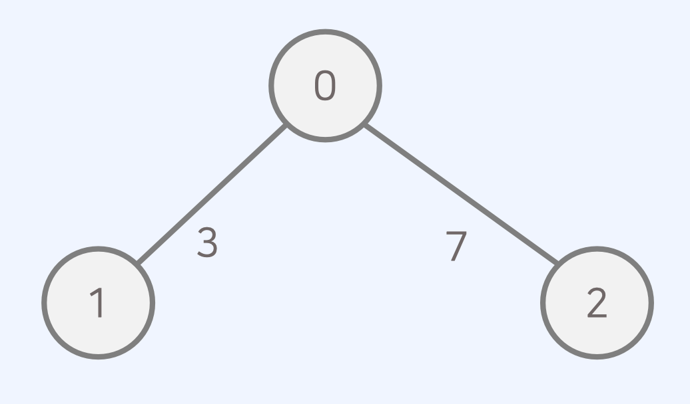

## 그래프(Graph)

- 그래프(graph)란 사물을 정점(vertex)과 간선(edge)으로 나타내기 위한 도구다.
- 그래프는 두 가지 방식으로 구현할 수 있다.
  1. 인접 행렬(adjacency matrix): 2차원 배열을 사용하는 방식
  2. 인접 리스트(adjacency list): 연결 리스트를 이용하는 방식

### 인접 행렬(Adjacency Matrix)

인접 행렬(adjacency matrix)에서는 그래프를 2차원 배열로 표현한다.


### 인접 행렬- 무방향 무가중치 그래프

- 모든 간선이 방향성을 가지지 않는 그래프를 무방향 그래프라고 한다.
- 모든 간선에 가중치가 없는 그래프를 무가중치 그래프라고 한다.
- 무방향 비가중치 그래프가 주어졌을 때 연결되어 있는 상황을 인접 행렬로 출력할 수 있다.
  

  ```js
  let graph = [
    [0, 1, 1, 0],
    [1, 0, 1, 0],
    [1, 1, 0, 1],
    [0, 0, 1, 0],
  ];
  console.log(graph);
  ```

### 인접 행렬- 방향 가중치 그래프

- 모든 간선이 방향을 가지는 그래프를 방향 그래프라고 한다.
- 모든 간선에 가중치가 있는 그래프를 가중치 그래프라고 한다.
- 방향 가중치 그래프가 주어졌을 때 연결되어 있는 상황을 인접 행렬로 출력할 수 있다.
  
  ```js
  let graph = [
    [0, 0, 7, 0],
    [3, 0, 8, 0],
    [0, 8, 0, 0],
    [0, 0, 4, 0],
  ];
  console.log(graph);
  ```

### 인접 리스트(Adjacency List)

- 인접 리스트(adjacency list)에서는 그래프를 리스트로 표현한다.
  
  ```js
  0: [(1, 3), (2, 7)]
  1: [(0, 3)]
  2: [(0, 7)]
  ```

### 인접 리스트- 무방향 무가중치 그래프

- 모든 간선이 방향성을 가지지 않는 그래프를 무방향 그래프라고 한다.
- 모든 간선에 가중치가 없는 그래프를 무가중치 그래프라고 한다.
- 무방향 비가중치 그래프가 주어졌을 때 연결되어 있는 상황을 인접 리스트로 출력할 수 있다.

  

  ```js
  let graph = [[1, 2], [0, 2], [0, 1, 3], [2]];
  console.log(graph);
  ```

### 인접 리스트- 방향 가중치 그래프

- 모든 간선이 방향을 가지는 그래프를 방향 그래프라고 한다.
- 모든 간선에 가중치가 있는 그래프를 가중치 그래프라고 한다.
- 방향 가중치 그래프가 주어졌을 때 연결되어 있는 상황을 인접 리스트로 출력할 수 있다.
  
  ```js
  let graph = [[(2, 7)], [(0, 3), (2, 8)], [(1, 8)], [(2, 4)]];
  console.log(graph);
  ```

### 그래프의 시간 복잡도


1. 인접 행렬: 모든 정점들의 연결 여부를 저장해 𝑂(𝑉2) 의 공간을 요구한다.

- 공간 효율성이 떨어지지만, 두 노드의 연결 여부를 𝑂(1) 에 확인할 수 있다.

2. 인접 리스트: 연결된 간선의 정보만을 저장하여 𝑂(𝑉 + 𝐸) 의 공간을 요구한다.

- 공간 효율성이 우수하지만, 두 노드의 연결 여부를 확인하기 위해 𝑂(𝑉) 의 시간이 필요하다.

### 인접 행렬 vs. 인접 리스트


- 최단 경로 알고리즘을 구현할 때, 어떤 자료구조가 유용할까?
- 각각 근처의 노드와 연결되어 있는 경우가 많으므로, 간선 개수가 적어 인접 리스트가 유리하다.
