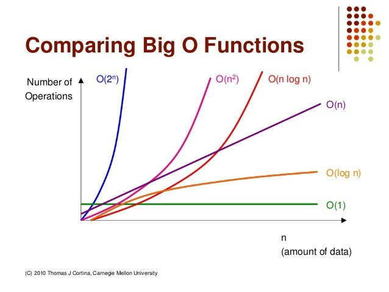

### 시간 복잡도란?

시간 복잡도는 알고리즘의 성능을 평가하기 위해 입력값의 크기와 연산 수행 시간을 수치화한 척도이다. 이는 코드의 성능을 비교하고 효율적으로 관리할 수 있도록 도와주는 중요한 개념이다. 시간 복잡도를 통해 어느 환경에서나 동일한 기준으로 코드의 성능을 측정할 수 있다.

### 점근적 표기법의 개념

점근적 표기법은 함수의 증가율을 단순화하여 표현하는 방법으로, 빅오(Big-O), 빅 오메가(Big-Omega), 빅 세타(Big-Theta) 표기법 등이 있다. 코딩 테스트에서는 주로 빅오 표기법을 사용한다. 이는 입력 크기 에 따른 연산의 실행 횟수를 단순화하여 시간과 공간 복잡도를 표현하는 방법이다.

### 알고리즘에 시간 복잡도를 적용하는 방법

예를 들어, 아래의 자바스크립트 코드가 있다고 치면

```js
for (i = 0; i < N; i++) {
  for (j = 0; j < N; j++) {
    count++;
  }
}
```

여기서 중첩된 for문의 경우, 첫 번째 반복문의 최대 반복 횟수는 **N**이며 두 번째 반복문의 최대 반복 횟수도 **N**이므로 시간 복잡도는 O(N \* N) = **O(N²)**이 됩니다.

다음과 같은 코드가 있다면:

```js
for (i = 0; i < N; i++) {
  count++;
}

for (i = 0; i < N; i++) {
  for (j = 0; j < N; j++) {
    count++;
  }
}
```

이 경우 시간 복잡도는 **O(N² + N)**이 되지만, **N**이 커질수록 **N²**에 비해 **N**의 영향은 미미해지므로, 결과적으로 **O(N²)**로 나타낼 수 있다. 점근적 표기법에서는 가장 높은 차수만을 고려하기 때문이다.

코딩 테스트에서 자주 사용하는 점근적 표기법은 다음과 같다:


**O(1) < O(log n) < O(n) < O(n log n) < O(n²) < O(2ⁿ)** <br/>
오른쪽으로 갈수록 비효율적인 알고리즘입니다.

### 프로그래머스의 채점 방식

프로그래밍 문제에서 자주 나타나는 시간 복잡도의 예시는 다음과 같습니다:

- O(1) : 배열 인덱스를 통한 원소 직접 접근
- O(log n) : 이진탐색
- O(n) : 순차탐색 -> (N ≤ 10,000,000)
- O(n log n) : 정렬 -> (N ≤ 1,000,000)
- O(n²) : 행렬곱셉, 다항식 계산 -> (N ≤ 5,000)
- O(2ⁿ) : 부분집합 구하기, 하노이 -> (N ≤ 20)
- O(N!) : 순열생성, 외판원문제(TSP) -> (N ≤ 11)

화살표 뒤의 값은 **대략적인** 의 크기에 따른 허용 시간 복잡도이다

### 예제 풀이

아래 다항식에 대해 점근적 상한을 구해주세요.

Y = 2ˣ - 3X² + 5x
-> O(2ˣ)

Y = X² + X! - 2ˣ
-> O(N!)

Y = 3X + logX - 4
-> O(N)

아래 문제를 읽고 점근적 상한을 구해주세요.

데이터가 N개인 배열을 순차탐색하는 경우
-> O(N)

행과 열이 각각 N개인 행렬의 원소를 모두 더하는 경우
-> O(n²)

N개의 동전을 던질때 앞/뒷면에 대한 모든 경우의 수
->O(2ⁿ)

### 문제

[입문문제 5페이지](https://school.programmers.co.kr/learn/challenges/beginner?order=acceptance_desc&page=5)
